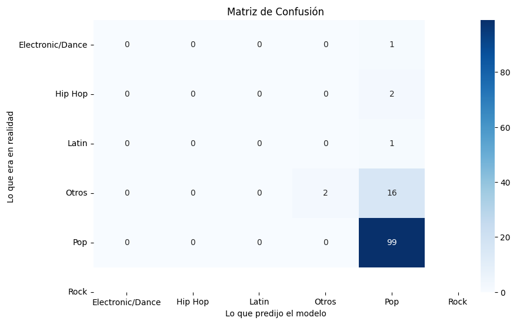

# 🎵 Music Genre Classification - Spotify Top 2010-2019

This project explores the application of Machine Learning algorithms to predict the musical genre of a song based on its audio features (BPM, energy, dance-ability, etc.).

The main goal of this experiment was to analyze the performance of a **Random Forest** classifier in a real-world, **highly imbalanced** dataset.

## 📂 Dataset

The data was obtained from Kaggle: [Top Spotify Songs from 2010-2019 - BY YEAR](https://www.kaggle.com/datasets/leonardopena/top-spotify-songs-from-20102019-by-year).

- **Inputs (Features):** Numerical variables such as `bpm`, `nrgy` (energy), `dnce` (dance-ability), `dB` (loudness).  
- **Target:** The variable `top genre`.

## ⚠️ The Challenge: Class Imbalance

During the Exploratory Data Analysis (EDA), we identified a critical issue in the dataset that served as a case study for this practice:

1. **Overly specific classes:** The original genres were too granular (e.g., *'canadian pop'*, *'barbadian pop'*, *'australian dance'*).  
2. **Dominance of the majority class:** More than **80%** of top global songs belonged to the **Pop** genre. Genres like *Rock*, *Hip Hop*, or *Latin* had very few examples (sometimes less than 5).

### 🛠️ Applied Solution: Feature Engineering

To mitigate this problem, we implemented preprocessing in Python to group subgenres into main categories:

```python
def simplify_genre(genre):
    if 'pop' in genre: return 'Pop'
    elif 'hip hop' in genre: return 'Hip Hop'
    # ... (rest of the grouping logic)
````

## 📊 Model Results

A **Random Forest Classifier** was trained.

| Global Metric | Value |
| ------------- | ----- |
| **Accuracy**  | ~84%  |



### Critical Analysis (The "Accuracy Trap")

Despite achieving 84% accuracy, a detailed analysis (Confusion Matrix) revealed the impact of class imbalance:

* **Pop Class:** The model had excellent precision and recall (>90%).
* **Minority Classes (Rock, Latin, Hip Hop):** The model achieved metrics close to **0%**.

**Experiment Conclusion:**
The model learned that, statistically, the safest strategy to minimize error was to classify almost all songs as "Pop". This case demonstrates the importance of balanced datasets and how *Accuracy* can be misleading on biased datasets.

## 🚀 How to Run the Project

1. Clone this repository.
2. Install the required dependencies:

   ```bash
   pip install -r requirements.txt
   ```
3. Open and run the file `notebook.ipynb`.

## 👤 Author

[Chengjie Peng Lin] - Kaggle Machine Learning Practice
